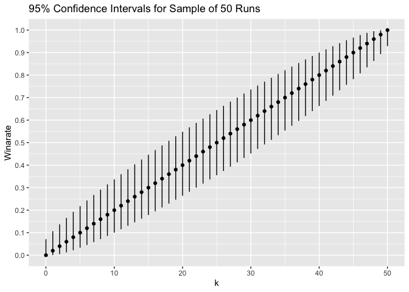
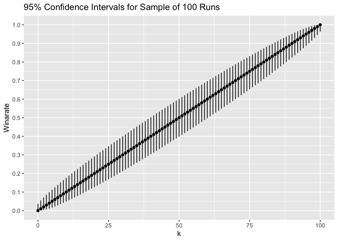

# What We Mean When We Talk About 'Winrate' in Slay the Spire

Suppose someone plays *n* runs of Slay the Spire on Ascension 20, and
kills the heart on *k* of the *n* runs. I’ll assume that we’re talking
about runs on a single character (e.g. just runs of The Watcher). One of
the ways in which the Slay the Spire community attempts to measure skill
is through ‘winrate’, *p̂* = *k*/*n*, the proportion of runs someone has
won over a large sample. In this post, I’ll try to discuss winrate, and
what we can learn about it, from a statistical perspective:

-   What is winrate actually estimating?
-   What can we say about uncertainty when estimating winrate?
-   When and how can winrate be used to compare the “skill” of different
    players?

As for qualifications, I’m currently getting my Ph.D. in statistics
(ABD), so I’d hope I know what I’m talking about on the statistics side
of things. I apologize about the math formatting, I have not figured out how to get mathjax working!

## What is Winrate Actually Estimating?

Let *x*<sub>1</sub>, …, *x*<sub>*n*</sub> denote the outcomes of
individual runs, where *x*<sub>*i*</sub> is 0 if the run was won, or 1
if the run was lost, so that
*k* = *x*<sub>1</sub> + … + *x*<sub>*n*</sub>. In statistics, we treat
these *n* outcomes as the data, and posit some model for the data in
order to answer some question(s). I’ll introduce three models of
increasing complexity that will help us answer the questions I’ve posed
regarding winrate.

### Model 1

Suppose we posit the following
[model](https://en.wikipedia.org/wiki/Bernoulli_distribution) for the
data: for *i* ∈ {1, …, *n*}

*x*<sub>*i*</sub>\|*p* <sup>*ind*</sup>~ Bernoulli(*p*).

Translating this model to English, this model says: the player has a
constant probability *p* ∈ \[0,1\] of winning each run, and the outcomes
of each run are
[independent](https://en.wikipedia.org/wiki/Independence_(probability_theory))
(in statistics this essentially means no run influences the outcome of
any other run).

The assumption that there is a constant probability *p* of winning each
run for the player is definitely not correct: some runs are harder or
easier than other runs based on the seed of the run. As a concrete
example, it is well known that there is a seed for The Silent that is
[(as of right now)
unwinnable](https://www.reddit.com/r/slaythespire/comments/mjuibc/are_all_seeds_winnable/gtckddh/),
so the probability of winning a run on that seed is 0.

The assumption that the outcomes of each run are independent isn’t
exactly correct:

-   When playing base Slay the Spire (i.e. using no mods that modify the
    core gameplay), losing before the act 1 boss on a run affects the
    whale bonus on the following run.
-   We aren’t perfect spire playing machines, so if you get tilted
    losing on one run, it can affect your next run.
-   We learn from our previous runs, which can affect how we play future
    runs.

It is well known that this
[Bernoulli](https://en.wikipedia.org/wiki/Bernoulli_distribution) model
for the individual trials implies the following
[model](https://en.wikipedia.org/wiki/Binomial_distribution) for the
number of runs won

*k* ∣ *n*, *p* ∼Binomial(*n*,*p*).

We next introduce a model that deals with the assumption of a constant
probability of winning each run.

### Model 2

Suppose we posit the following
[model](https://en.wikipedia.org/wiki/Bernoulli_distribution) for the
data: for *i* ∈ {1, …, *n*}

*x*<sub>*i*</sub>\|*p*<sub>*i*</sub> <sup>*ind*</sup>~ Bernoulli(*p*).

Translating this model to English, this model says: the player has a
run-specific probability *p*<sub>*i*</sub> ∈ \[0,1\] of winning each
run, and the outcomes of each run are
[independent](https://en.wikipedia.org/wiki/Independence_(probability_theory)).

The assumption that the outcomes of each run are independent still isn’t
exactly correct as discussed in Model 1. That being said, we’re probably
not losing too much statistically by making this assumption (and it’s
actually pretty hard to weaken it as I’ll discuss), and it’s at least
correct marginally for any run (i.e. any given run by itself is
necessarily a
[Bernoulli](https://en.wikipedia.org/wiki/Bernoulli_distribution)
trial). As a statistician, I think making this assumption is a very
reasonable approximation of reality.

The assumption that there is a run-specific probability
*p*<sub>*i*</sub> of winning each run is essentially correct. This
captures the intuition that some seeds are easier or harder than others,
and allows for the example described in Model 1 of an unwinnable seed.
We can even go a step further in this model:

*x*<sub>*i*</sub>\|*p*<sub>*i*</sub> <sup>*ind*</sup>~ Bernoulli(*p*),

*p*<sub>*i*</sub> <sup>*iid*</sup>~ *Q*.

Translating this model to English, this model says: the player has a
run-specific probability *p*<sub>*i*</sub> ∈ \[0,1\] of winning each
run, where the run-specific probabilities are independently and
identically generated from some distribution *Q* supported on \[0,1\],
and the outcomes of each run are independent. Here *Q* is typically
referred to in statistics as a [mixing
distribution](https://en.wikipedia.org/wiki/Mixture_distribution), and
is a statistical way to describe how runs are randomly generated based
on a seed, which in turn determines how hard the run is for a given
player. We can even explicitly write down *Q* here! Let’s say there are
*M* total seeds of Slay the Spire (*M* ≈ 18.4
[quintillion](https://forgottenarbiter.github.io/Is-Every-Seed-Winnable/)).
Then *Q* = (1/M)(*δ*<sub>*p*<sub>*1*</sub></sub> + … + *δ*<sub>*p*<sub>*M*</sub></sub>), where *δ*<sub>⋅</sub>
is an [indicator
function](https://en.wikipedia.org/wiki/Indicator_function), i.e. *Q* is
a [discrete finite
mixture](https://en.wikipedia.org/wiki/Mixture_distribution).

It is not that well known (but easy to show) that this model for the
individual trials implies the following
[model](https://en.wikipedia.org/wiki/Binomial_distribution) for the
number of runs won

*k* ∣ *n*, *p* ∼ Binomial(*n*,*p*),

where *p* = *E*<sub>*Q*</sub>\[*p*<sub>*i*</sub>\] = (1/M)(*p*<sub>*1*</sub> + … + *p*<sub>*M*</sub>) is the [expected
value](https://en.wikipedia.org/wiki/Expected_value) of the run-specific
probabilities under *Q*.

If you’re paying attention, we have just found out that Model 1 and
Model 2 actually imply the same statistical model for the number of runs
won *k* given *n*, with different interpretations of the Binomial
parameter *p*:

-   Under Model 1, *p* is the probability of winning a run (i.e. each
    run has the same probability of winning).
-   Under Model 2, *p* is the *average* probability of winning a run
    (i.e. each run does not have the same probability of winning).

### Model 3

Model 2, while more general than Model 1, wasn’t *exactly* faithful to
reality, due to the assumption of independence of runs. We now introduce
a model that deals with this assumption:

(*x*<sub>1</sub>,…,*x*<sub>*n*</sub>) ∼ *F*.

Translating this model to English, this model says: the outcomes of all
of the runs come from some distribution *F* on {0, 1}<sup>*n*</sup>.
This isn’t terribly helpful! We’re basically just punting and saying
“the outcomes come from some distribution”, which is true of any
literally data set. It's possible to using [conditional probability](https://en.wikipedia.org/wiki/Conditional_probability) to expand this into something resembling Model 2, but it doesn't actually end up getting us somewhere, so I'll spare the details.

### So What is Winrate Actually Estimating?

To talk about what *p̂* = *k*/*n* is actually estimating, we need to
settle on a model. So I’ll first talk about what what *p̂* is estimating
in each model, and then provide a suggestion for what I believe is the
model that the Slay the Spire community should use.

Under Model 1, *p̂* is an estimate of the parameter *p*, the probability
of winning a run, where each run has the same probability of winning.
Under this assumed model, *p̂* is an
[unbiased](https://en.wikipedia.org/wiki/Bias_of_an_estimator) and
[consistent](https://en.wikipedia.org/wiki/Consistent_estimator)
(although appealing to asymptotics is somewhat hairy here since there
are a finite number of seeds one can play) estimator of *p* (and is also
the [maximum likelihood
estimator](https://en.wikipedia.org/wiki/Maximum_likelihood_estimation)).

Under Model 2, *p̂* is an estimate of the parameter *p*, the average
probability of winning a run. Under this assumed model, *p̂* is an
[unbiased](https://en.wikipedia.org/wiki/Bias_of_an_estimator) and
[consistent](https://en.wikipedia.org/wiki/Consistent_estimator)
estimator of *p* (and is also the [maximum likelihood
estimator](https://en.wikipedia.org/wiki/Maximum_likelihood_estimation)).

Under Model 3, I don’t believe there is a satisfying answer for what *p̂*
is estimating, specifically because we’ve relaxed the assumption of
independence of runs. While this model is the closest to reality, it’s
the least helpful for actually understanding reality!

*I believe that the Slay the Spire community should use Model 2, so that
when we talk about winrate, we are really trying to estimate the average
probability that a given player wins a run, where average is respect to
the run seeds.* For the rest of this post, I’ll use *true winrate* for a
player to refer to *p*, the average probability that a given player wins
a run (mostly cause it’s less wordy), and *sample winrate* for a player
to refer to *p̂*, the proportion of runs that they’ve won over a sample.

I’ll note here something interesting about estimating *p* in Model 2. If
we were trying to estimate the individual *p*<sub>*i*</sub>, the
run-specific probabilities of winning runs, we would be out of luck!
Clearly it’s not possible for an individual to perform independent runs
of the same seed, since playing on the seed one time gives you knowledge
that can influence your future runs on the seed, which changes your
probability of winning future runs on the seed. Thus one is left with a
win or a loss for each seed they play, which isn’t exactly useful for
estimating the probability of winning that run. However, because the
implied model for *k* given *n* is binomial, it allows us to estimate
the expected value of the the run-specific probabilities of winning
runs.

## What Can We Say About Uncertainty When Estimating Winrate?

Lucky for us, since Model 2 implies that
*k* ∣ *n*, *p* ∼ Binomial(*n*,*p*),
we can come up with estimates of uncertainty for *p* very easily. In
particular, it is very easy to come up with [confidence
intervals](https://en.wikipedia.org/wiki/Confidence_interval) for *p*,
the true winrate: a 100 × *α*% confidence interval \[*a*,*b*\] for *p*
is an interval such that there is probability *α* (or greater) that the
true value of *p* lies between *a* and *b*. This is a
[frequentist](https://en.wikipedia.org/wiki/Frequentist_inference)
notion of uncertainty, one could similarly come up with
[Bayesian](https://en.wikipedia.org/wiki/Bayesian_inference) credible
intervals, but I’ll focus on confidence intervals for simplicity. Lots
of methods for constructing confidence intervals in statistics are based
on asymptotic approximations (i.e. they’re only valid for large sample
sizes). However, for this binomial model, we can come up with [exact
finite sample confidence
interval](https://en.wikipedia.org/wiki/Binomial_proportion_confidence_interval#Clopper%E2%80%93Pearson_interval)
using the function <tt>binom.test</tt> in <tt>R</tt> (the most common
statistical programming language, which I used to create this post).

For example, suppose someone wins *k* = 25 runs in a *n* = 50 sample, so
that their sample winrate is *p̂* = 0.5. Then one can simply run the
following code to generate a 95% confidence interval for their true
winrate:

``` r
k <- 25
n <- 50
conf_int <- binom.test(k, n)$conf.int
conf_int
```

    ## [1] 0.355273 0.644727
    ## attr(,"conf.level")
    ## [1] 0.95

Note that for a 50 run sample, the width of the confidence interval,
0.355273 to 0.644727, is quite large! It’s possible that someone with a
true winrate of *p* = 0.36 could have lucked their way into a 50% sample
winrate, or alternatively someone with a true winrate of *p* = 0.64
could have gotten very unlucky on their way into a 50% sample winrate.

Suppose instead that someone wins *k* = 50 runs in a *n* = 100 sample,
so that their sample winrate is still *p̂* = 0.5. The resulting 95%
confidence interval for their true winrate is then:

``` r
k <- 50
n <- 100
conf_int <- binom.test(k, n)$conf.int
conf_int
```

    ## [1] 0.3983211 0.6016789
    ## attr(,"conf.level")
    ## [1] 0.95

For a 100 run sample, the width is reduced, but still quite large!

I’ll now plot the 95% confidence intervals for given sample winrates in
samples of *n* = 50 and *n* = 100 runs. The x-axes are how many runs
were run in the sample, the y-axes are the correspondning winrates, dots
are the sample winrates, and the lines show the ranges of the 95%
confidence intervals for the true winrates.



What I’m trying to illustrate here is that one needs to take uncertainty
into account when talking about winrate. Larger sample sizes reduce our
uncertainty when estimating true winrate, but even with a sample size of
*n* = 100 (which can take months to complete), there’s still a fair
amount of uncertainty.

For example, Life Coach has the highest recorded sample winrate on The
Watcher over a large sample, having won *k* = 47 of *n* = 50 runs, for a
sample winrate of *p̂* = 0.94.

``` r
k <- 47
n <- 50
conf_int <- binom.test(k, n)$conf.int
conf_int
```

    ## [1] 0.8345181 0.9874514
    ## attr(,"conf.level")
    ## [1] 0.95

But note that the 95% confidence interval based on this sample doesn’t
rule out that Life Coach actually has a true winrate of *p* = 0.84. Most
people confidently talk about the true winrate of The Watcher at the
highest levels as being somewhere in the *p* \> 0.9 range. While I don’t
doubt that this is true based on Merl’s recent performance, it’s hard to
currently say this with confidence from a statistical perspective. For a
sample of *n* = 50 runs, *one needs to win all 50 runs for a 95%
confidence interval to rule out *p* \< 0.9*. For a sample of *n* = 100
runs, *one needs to win all 96 runs for a 95% confidence interval to
rule out *p* \< 0.9*. We have not seen that level of play on The Watcher
in a large sample!

## When and How Can Winrate Be Used to Compare the “Skill” of Different Players?

So we’ve talked about what we mean by winrate from a statistical
perspective, and how to get at uncertainty. Now the reason why people
usually like to talk about sample winrate is to compare the “skill” of
different players in the community, where those with higher sample
winrates are seen as more skillfull. This sort of comparison isn’t very
useful *unless* the conditions different players are playing under are
comparable. For example, the players under comparison should all be:

-   Playing in a sample that has a clearly defined beginning and end.
    Not doing so could lead to statistical biases. For example, if one
    wins a run, then retroactively starts the sample, this can lead to a
    form of [selection
    bias](https://en.wikipedia.org/wiki/Selection_bias). Or if one stops
    a sample once they’ve hit a certain sample winrate, this can lead to
    a form of early stopping bias, which is a form of [selection
    bias](https://en.wikipedia.org/wiki/Selection_bias) (although this
    can be handled with [modern statistical
    methods](https://www.stat.cmu.edu/~aramdas/sequential.html)).
-   Playing in a sample of just one character. If one is instead
    interested in rotating winrate, you should only be comparing
    rotating samples between players. In the case of rotating, after
    appropriately modifying the models described in the previous
    section, you will find that the sample winrate is estimating the
    average probability of winning a run, averaged across the four
    characters.
-   Trying to maximize their sample winrate. If a player is purposefully
    not trying maximize their chance of winning, obviously it is not
    useful to compare their sample winrate to a player trying to
    maximize their chance of winning each run. For some people, it’s not
    fun to try to min-max every decisision, so they shouldn’t be
    compared to players that do! Also, some people (Jorbs and Merl) have
    done challenges where they try to beat the heart a certain number of
    times in a certain number of days, and they have to change up their
    playstyle to complete these challenges, so clearly their sample
    winrates over these challenges will be different than if they
    weren’t trying to maximize the number of hearts beaten in a certain
    number of days.
-   Either playing base Slay the Spire, or playing Slay the Spire with
    an agreed upon set of core gameplay modifying mods. For example,
    there needs to be a consensus on the use of mods that deal with
    [correlated
    randomness](https://forgottenarbiter.github.io/Correlated-Randomness/),
    [always give 4 choices for the whale
    bonus](https://steamcommunity.com/sharedfiles/filedetails/?id=1759850158)
    even when dying in the previous run before the Act 1 boss, [tell you
    potion odds](https://github.com/casey-c/infomod2) (some actions like
    smoke bombing can change potion odds without the player knowing, but
    mods can give you that knowledge), etc. There should also be
    consensus about the use of mods that don’t modify gameplay, [but
    keep track of information that could of otherwise have been kept
    track of by the player](https://github.com/casey-c/infomod2)
    (e.g. question mark odds, turn number, remove costs, etc.).
-   Either talking with chat or not talking with chat for the entirety
    of their runs.
-   Not using glitches or save and quit in their runs.

These are just the conditions I could think of right now, others may
have suggestions for further conditions to fix. Note here that I said
nothing about the run lengths. If one of the conditions is that players
are trying to maximize sample winrate, then there should be no
restrictions on run lengths. If one wants a condition to be something
like “complete each run in *x* amount of time”, they should be free to
do so, but they need to be explicit about these sorts of conditions
before making comparisons.

It should be clear that it is not well defined to try to use winrate to
compare someone like Jorbs, [the only high level Spire player that I
know of that does not involve chat in decision making and who is quite
clear that his goal is not to maximize sample
winrate](https://www.twitlonger.com/show/n_1srmbl3), to other top level
players that involve chat in their decision making and play to maximize
sample winrate.

Now let’s say you do have two players that have completed large samples
under comparable conditions. Based on the discussion of uncertainty in
the last section, it should be clear that simply comparing sample
winrates is not very useful, one needs to also take into account
uncertainty. In particular, just because one player has a higher sample
winrate than another player, does not mean that we can rule out
statistically that the players actually have different true winrates.
Let *p*<sub>1</sub> denote the true winrate for player 1,
*p*<sub>2</sub> denote the true winrate for player 2, and
$\\varDelta=p_1-p_2$ denote the different between their true winrates.
Then if we similarly let *p̂*<sub>1</sub> denote the sample winrate for
player 1, and *p̂*<sub>2</sub> denote the sample winrate for player 2,
then $\\hat{\\varDelta}=\\hat{p}\_1-\\hat{p}\_2$, the difference of
their sample winrates, is an estimate of $\\varDelta$. We can come up
with a 95% confidence interval for $\\varDelta$ using the function
<tt>prop.test</tt> in <tt>R</tt> (this function does not compute exact
finite sample confidence intervals, but rather approximate confidence
intervals, but they’re perfectly fine for our use).

For example, suppose player 1 wins *k* = 25 runs in a *n* = 50 sample,
so that their sample winrate is *p̂*<sub>1</sub> = 0.5, and player 2 wins
*k* = 35 runs in a *n* = 50 sample, so that their sample winrate is
*p̂*<sub>1</sub> = 0.7. Then their difference in sample winrates is
$\\hat{\\varDelta}=-0.2$, which is pretty large! Then one can simply run
the following code to generate a 95% confidence interval for
$\\varDelta$:

``` r
k <- c(25, 35)
n <- c(50, 50)
conf_int <- prop.test(k, n)$conf.int
conf_int
```

    ## [1] -0.407993141  0.007993141
    ## attr(,"conf.level")
    ## [1] 0.95

What we find is that the 95% confidence interval includes 0, so we can’t
actually rule out that the two players have the same true winrates! This
will be surprising to those without some stats training, since we
normally talk in the Slay the Spire community about player 2 as if
they’re definitively better than player 1. However, statistically, you
can’t actually say this with confidence.

Most of the time, unless one has very large samples (larger than what’s
normally done in the Slay the Spire community), and the sample winrates
of the players are very well separated, what you’ll find is that it’s
very hard statistically to say one player has a higher true winrate with
confidence!
